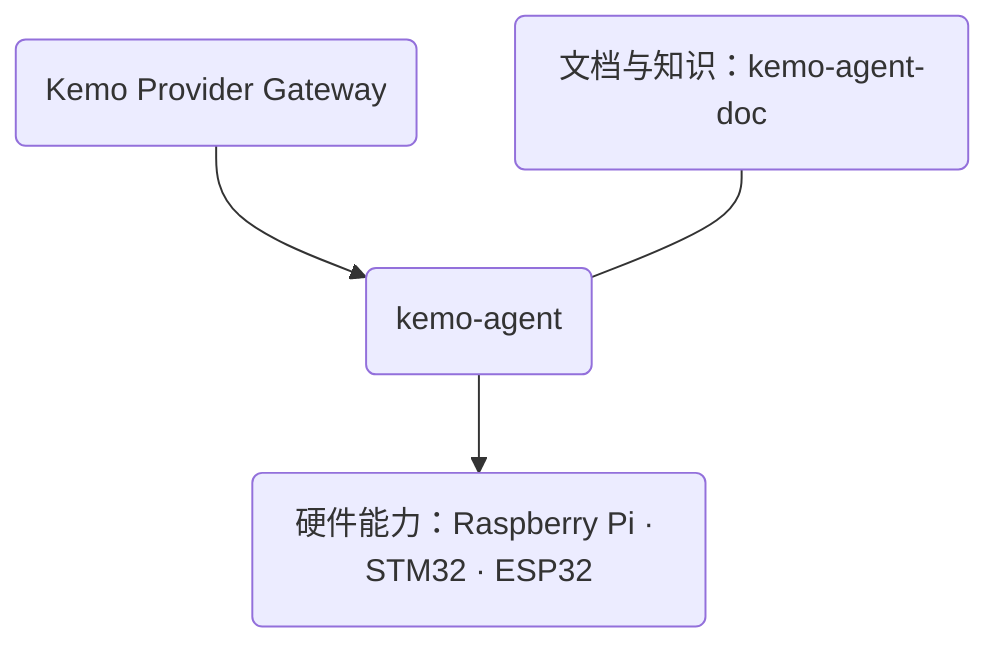

# ✨ 你好，我是 kesepain

**个人智能基础设施的构建者 · AI Agent 开发者 · 嵌入式学习者**

---

## 我在构建什么

我关注的不是一个只会回答问题的聊天窗口，而是**能够长期陪伴、持续理解并真正把事情推进下去的个人智能基础设施**。

这套探索从本地 Agent Runtime 出发：让记忆、上下文、任务、工具、环境感知和外部世界的连接能够在同一个可掌控的工作空间里协作；再以统一的模型协议网关隔离厂商差异，并把能力延伸到真实设备与嵌入式硬件。

我喜欢把复杂系统拆成边界清晰、可以独立维护的模块：**通过 API 和明确协议协作，而不是把所有东西堆进同一个仓库。**

- **Kemo Provider Gateway**：多厂商模型、多模态与计量。
- **kemo-agent**：记忆、任务、子代理、工具、感知、扩展与多入口交互。
- **硬件能力**：通过独立技能包和协议连接 Raspberry Pi、STM32 与 ESP32。

---

## 核心项目

| 项目 | 定位 | 当前进展 |
|:--|:--|:--|
| [**kemo-agent**](https://github.com/kesepain-KE/kemo-agent) | 面向个人智能基础设施的本地多用户 Agent Runtime | 潮汐生命周期记忆、上下文管理、子代理、任务计划、定时调度、工具、感知、扩展和跨平台交互已形成可运行闭环。 |
| [**kemo-adapter-api**](https://github.com/kesepain-KE/kemo-adapter-api) | Kemo Provider Gateway，多厂商模型协议网关 | 统一模型发现、流式响应、工具调用、能力声明、多模态 Asset、Embedding、Rerank 与 Token 计量。 |
| [**kemo-agent-doc**](https://github.com/kesepain-KE/kemo-agent-doc) | kemo-agent 的 VitePress 文档站 | 安装、配置、使用与扩展开发文档；已部署为 [在线文档](https://kesepain-ke.github.io/kemo-agent-doc/)。 |
| [**raspberry-pi-skill**](https://github.com/kesepain-KE/raspberry-pi-skill) | 面向通用 AI Agent 的树莓派硬件技能包 | 用 `SKILL.md`、JSON Schema 与稳定 CLI 将 GPIO、PWM、设备语义控制和系统状态交给 Agent。 |

### 正在学习与延伸

- **STM32**：使用 STM32F103C8T6、标准外设库与寄存器级开发，沿着 GPIO、蜂鸣器、流水灯等基础外设一步步建立嵌入式能力。
- **ESP32**：探索 Wi-Fi、GPIO 与 Agent 能力的连接，让智能体可以在现实世界中感知和执行。
- **长期智能体**：持续打磨记忆生命周期、可恢复上下文、可控任务编排，以及本地优先的数据边界。

---

## 设计信念

> 真正长期的智能关系，不应依赖一次精彩的回答，而应来自无数次可靠、克制且连续的协作。

- **本地优先，数据可掌控**：对话、记忆、知识、任务和文件应由使用者查看、备份和迁移。
- **边界优先，模块独立**：核心框架、网关、文档和硬件能力各自独立，通过稳定协议连接。
- **能力增长不等于失去控制**：复杂任务先形成可理解、可干预的计划；自动化也要保留确认、暂停与回溯的权利。
- **从软件走向物理世界**：AI 的价值不只在屏幕里，也在于能否安全、可靠地理解环境并连接真实设备。
- **持续学习，尊重基础**：从 Python、协议与系统设计，到 MCU 寄存器和硬件引脚，耐心把每一层原理弄清楚。

---

## 技术地图

  

---

## GitHub 活动

  
  

   
  

---

如果你也在关注长期记忆、可控智能体、多模型协议、个人 AI 基础设施，或是 AI 与嵌入式硬件的结合，欢迎来交流。

[GitHub Profile](https://github.com/kesepain-KE) · [kemo-agent](https://github.com/kesepain-KE/kemo-agent) · [Online Docs](https://kesepain-ke.github.io/kemo-agent-doc/)

